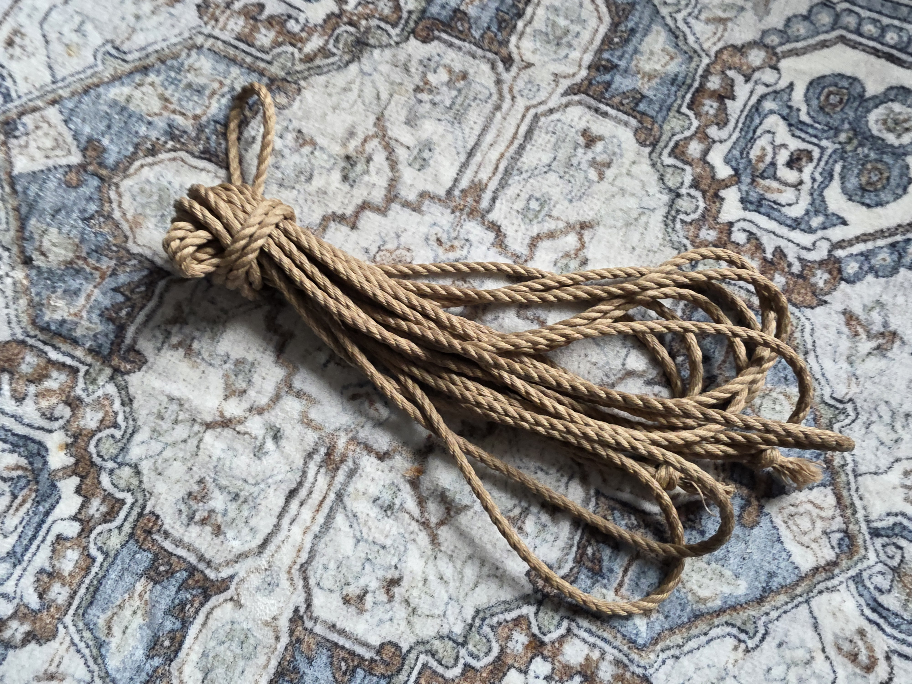
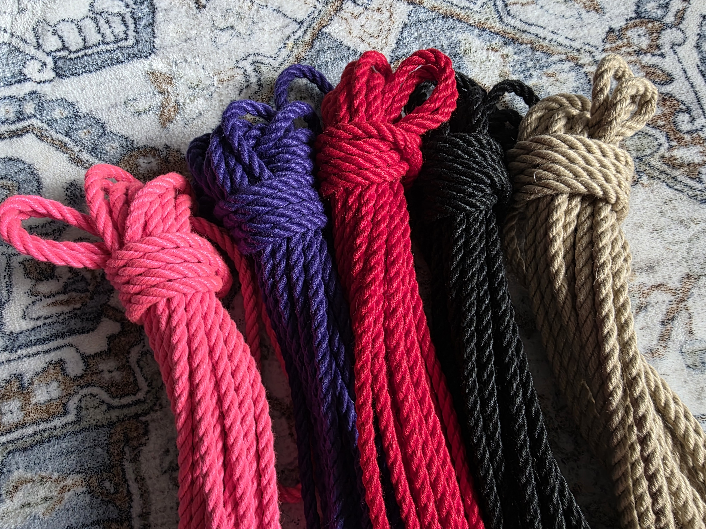
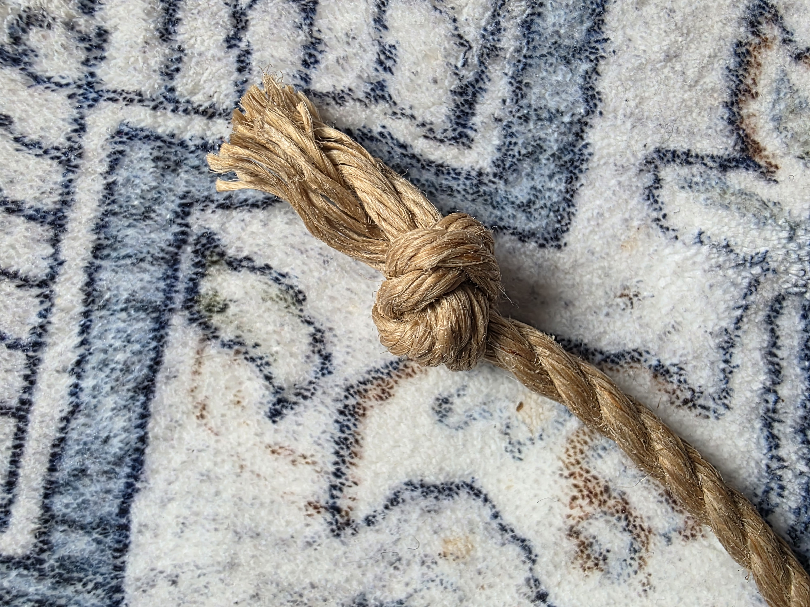

# Torinawa

Torinawa is a Toronto based producer of high quality, JBO free, rope for shibari.

We partner with the best manufacturers and process the rope by hand to give the best experience possible.

You can find our products at [Birdhaus](https://www.birdhausto.com/)!

If you have any questions you can [email us.](mailto:torinawaltd+sales@gmail.com)

## Products

### Premium JBO Free Jute Rope

We work with a specialist from one of Japans largest rope companies to import the highest quality jute rope that is designed and manufactured with shibari/bondage in mind. Our manufacturer works with the farmers directly to select the best plants for fiber strength and feel, and ensures you're getting the best quality for your dollar. The rope is then manufactured in ethically run processing plants in Bangladesh, using soybean oil instead of the cancergenic white petroleum based Jute Batching Oil. The rope twist and fiber density is carefully calculated to give you an end result that is strong, stays together under rigorous use and lasts!

This rope then is packaged in recyclable packaging, avoiding the use of plastics, and imported by Torinawa into Canada, right here in Toronto, ON.

You can purchase the rope in 145m spools right from the manufacturer, giving you the freedom to finish your experience however you like or you can purchase 8, 9, or 10 meter length already processed for you.

We use a 10 step process to make sure your rope is ready to be used:

1. We cut the rope to length off the spool, making sure that there are no defects in the line.
2. The ropes are then run through our dryers at a high temperature to loosen and remove jute dust and small fibers.
3. After "de-fluffing" the rope is covered in our specially formulated, Soybean wax and Jojoba oil, Rope Butter, and placed back into the dryers to set.
4. Once the Rope Butter is absorbed deep into the fibers we singe off the little stray jute fibers on the lines with a blue flame.
5. The rope then is treated with Soybean wax and Jojoba oil Rope Lotion which give it that last moisturizing protective coating.
6. The last step is to work out all the built up energy from the process, making sure your ropes have little to no twist in them when you receive them. The rope them rest hung up for at least 24h.

This labour intensive process leaves you with a fantastic rope ready for bondage for years to come.

Our processed jute comes in 8m, 9m and 10m lengths. Custom sized orders require purchase of a minimum of 1 spool's 145m worth of rope.

### Langman POSH

[POSH (stands for Portside Out, Starboard Home)](https://www.langmantouw.nl/en/product/posh/), is a spun polyester role (spun PET), that looks like a natural fiber rope. It has become a crowd favorite for shibari, particularly for its application in dangerous or dirty situations. The rope combined a soft touch, low stretch, and high UV and 100% strength retention when wet. You can use it to tie outside, in the water and more with no worries. Washable and safety rated this is a great alternative or addition to our natural Jute.

We currently carry POSH in the following colors:

- beige (natural)
- black
- red
- purple
- pink

We can cut the POSH to whatever size you need with the minimum of 1 meter.

### Miscellaneous

We also sell:

- Rope Butter and Lotion for jute rope treatment.
- Safety Sheers for cutting rope.

## FAQ

### What length of rope should I use?

Most beginners will want to get 4 x 8m lengths, if you tie larger individuals getting 9m or 10m ropes may work better.

### Why is JBO (Jute Batching Oil) bad?

JBO is used to reduce friction in the jute fiber machining process, most of the time this rope was meant to be used in commercial situations so the cheapest and most abundant lubricant was used, this white petroleum has been found to cause all sorts of nasty conditions when applied on skin as seen in this [PubMed Study on mice](https://pmc.ncbi.nlm.nih.gov/articles/PMC2041502/).

Our manufacturer put out [a video detailing this.](https://www.youtube.com/watch?v=I72KymMR7i4)

### How do you finish your rope ends?

We use a flattened square knot to keep out rope ends from coming undone.

